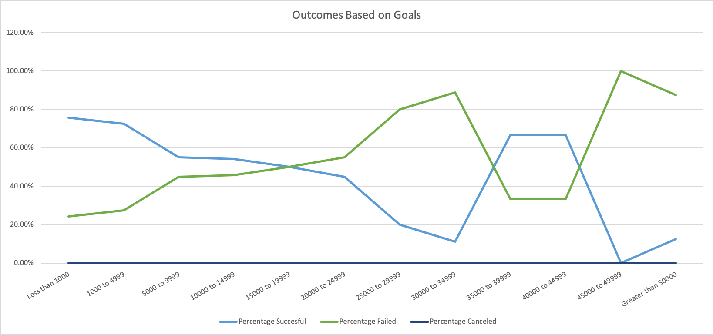
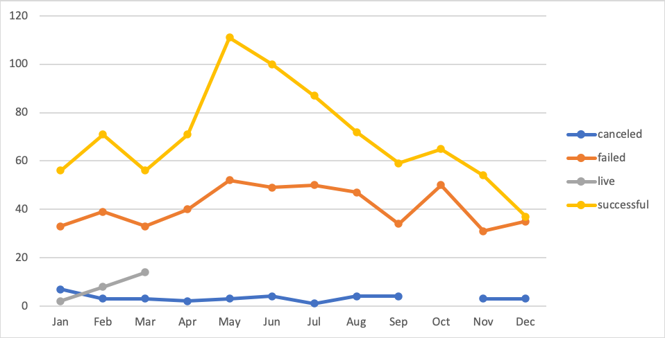

# An analysis of Kickstarter Campaigns
Analysis of Kickstarter campaigns to create strategy for client hoping to create campaign to fund her play in the United States.

# Observations

### 1. Kickstarter campaigns dedicated to funding plays had a higher success rate when the funding goal was a lower amount
  As shown in the graph above, kickstarter campaigns that were created to fund plays and had a campaign goal of less than $1,000 had the highest rate of success at 75.8%. As the campaign goal increased the rate of success would decrease, with the exception of campaigns that had a goal between $35,000 and $44,999 which spiked with a success rate of 66.7%. 

### 2.Kickstarter campaigns dedicated to funding plays had a higher rate of failing when the funding goal was a higher amount
  For kickstarter campaigns that had goals between $15,000 and $19,999, there was a 50% rate of failing. This marks the point where the rate of failure is equivalent to the rate of success and from there continues on to increase and surpass the rate of success. The only exception, again, are in campaigns that have goals between $35,000 and $44,999 with a failure rate of 33.3%.
  

### 3. Kickstarter campaigns that were created in the summer were the most successful
The month with the most successful theater campaigns was May, with 111 out of 166 successful campaigns. This was followed by June with 100 out 153 successful campaigns.

## Limitation In Dataset
Overall, in the first visualization we can see an inverted relationship between the fundraising goal and success rate, but there is a spike that occurs in our data between the $35,000 to $39,999 and $40,000 to $44,999 goal categories. This is because there is such a small sample size for these categories. For the $35,000 to $39,999 category there are a total of 6 campaigns and the $40,000 to $44,999 goal category, there are only 3. Because there are so few data points for the $35,000 to $39,999 and $40,000 to $44,999 goal categories, their success rate appears to be a lot higher. With a larger data set, we would more than likely be able to see a decline in success rate much like the rest of our data.

# Reccomendation

If the client would hope to have a successful kickstarter campaign for a play, she should create a campaign between the months of May and June with a goal of about $5,000 or less.
